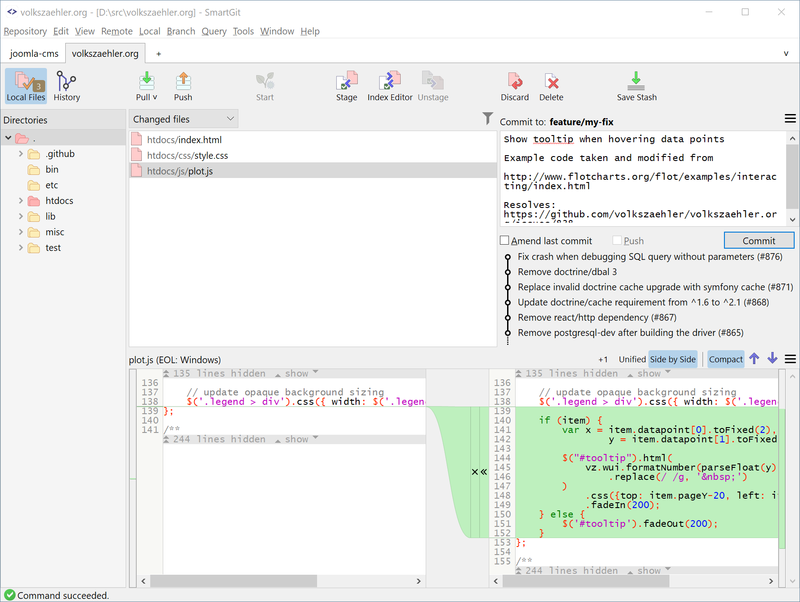

# Standard Window

The Standard Window is one of the [Main Windows](Main-Windows.md) available in SmartGit, which focuses on teams who have adopted a uniform approach to development, such as the [Feature-Flow](../DevelopmentProcesses/Feature-Flow.md) development process.

## Why Use the Standard Window?

The Standard Window hides many of the more advanced Git capabilities, and concentrates on assisting development teams to create new features, address bugfixes, and generally work in a uniform, disciplined approach, against a single remote repository.

Each tab in the Standard Window focuses on a single Repository at a time. Additional repository tabs can be added by clicking on the `+` icon, opening the **Repository Selection View**.

## Elements of the Standard Window

There are two perspectives (i.e. layouts) available in the Standard Window:

- A **Local Files** perspective, which focuses on the local Working Tree of the current repository, on a single branch (usually a new feature or bugfix branch):
    - The *Directories View*, showing the folder structure of the current branch in the Repository.
    - A variant of the *Files View*, showing the files within the directory selected in the *Directories View*. A simplified drop-down filter allows control of the files listed in the View:
        - Whether to show All, Changed, and/or Ignored files
        - Define the Sort Order of files in the view.
    - A **Commit View** (in working tree mode), allowing new commits to be created from staged Working Tree changes
      In the **Standard Window**, the **Commit View** includes additional functionality:
      - A **Journal** view of the most recent commits. You can copy the commit message from a previous commit by clicking on it in the Journal tree.
      - The option to [Push](Repository/Synchronizing-with-Remote-Repositories.md#push) to the configured tracking remote after the commit is completed.
    - A **Compare View**, showing changes made on the selected file in the Working Tree, or changes between the selected commit(s).
- A **History** perspective, which focuses on the local Working Tree of the current repository:
    - An accordion containing the below views. Click on one of the labels in the accordion to select the view:
        - The **My History View** - This view shows all branches in the Repository that the user has used recently. Double clicking on a branch will attempt check-out on that branch.
        - The **All Branches + Tags View** - Although similar to the **My History View**, all branches and tags are shown in the **All Branches + Tags View**, including remote branches. There is a search widget at the top of the view to allow you to quickly find a particular branch or tag in a large repository.
    - **Stashes View** - The **Stashes View** shows any locally stashed commits, which can be applied to a branch, or discarded, as required.
    - **Reflog View** - Shows the Git Reflog, showing an audit of the changes to `refs/` in the current repository.
- A variant of the **Graph View**, showing the visual history of the repository, as at the state of the current checked out HEAD. Above this view, there are widgets to:
    - Control the width of the Log Graph, from the viewpoint of either just the Current Branch, or for the entire repository.
    - Perform a search (click on the *filter icon*), for a specific author, committer, commit message, or SHA ID. Additionally, search within file content itself is possible, however this is very resource intensive and is not generally encouraged.
    - The `☰` icon allows configuration of:
        - the columns displayed in the *Graph View*
        - how the committer is displayed (choose between various Avatar, Name and Email options)
        - whether tags are shown in the view or not (in addition to the current branch HEADs).
    - The **Commit View** in commit mode, showing commit audit information about the selected commit, such as the timestamp, author, and commit message.
      Two commits can be selected in the Graph, which will show the commit metadata for both commits.
    - The **Files View**, showing files changed in the selected commit.
    - If a File is selected in the *Files View*, the difference will appear in the *Changes View*.

## Features available ONLY in the Standard Window

The following functionality is unique to the Standard Window:

- Support for the [Feature-Flow development process](../DevelopmentProcesses/Feature-Flow.md)
- Support for [GitHub Actions](../Integrations/GitHub-Actions.md), if you have the GitHub integration enabled and configured
- Support for showing [Jenkins job results](../Integrations/Jenkins.md), if you have the Jenkins integration enabled and configured
- Support for showing [Team City Build results](../Integrations/TeamCity.md), if you have the TeamCity integration enabled and configured
